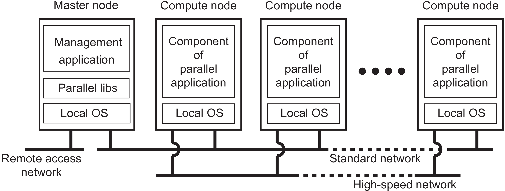
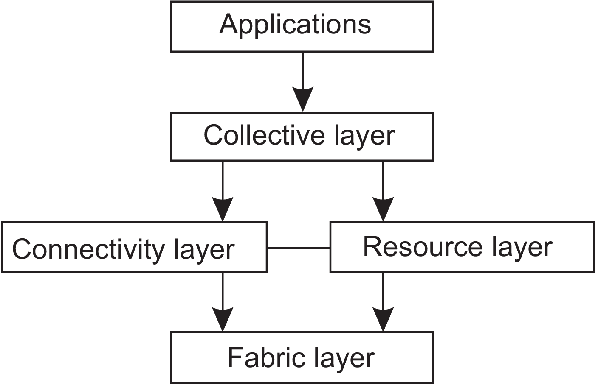

We make a distinction between distributed computing systems, distributed information systems, and pervasive systems. 

???+note "cluster computing vs. grid computing vs. cloud computing "
    In cluster computing, the underlying hardware consists of a collection of similar workstations or PCs connected by LAN. But in grid computing, the subgroup consists of distributed systems that are different when it comes to hardware, software, and deployed network technology. As for cloud computing, it provides the facilities to dynamically construct an infrastructure and compose what is needed from avaliable services.

### Cluster computing

Here we give two examples about cluster computing:

???+info "Beowulf clusters"
    Apart from the master node, the compute nodes are seen to be highly identical. The master handles the allocation of nodes and manages the jobs and provides an interface for the users of the systems.
    

???+info "MOSIX system"
    MOSIX attemps to provide a single-system image by allowing processes to dynamically and preemptively migrate between the nodes that make up the cluster.
    
However, several morden cluster computers have moved to more hybrid solutions where middleware is functionally patitioned across different nodes, becuase compute nodes with dedicated middleware will most likely provide optimal performance.

### Grid computing

???+info "Architecture"
    A traditional architecture is shown below. This architecture consists of 4 layers. The fabric layer provides interfaces to local resources at a speci
    

